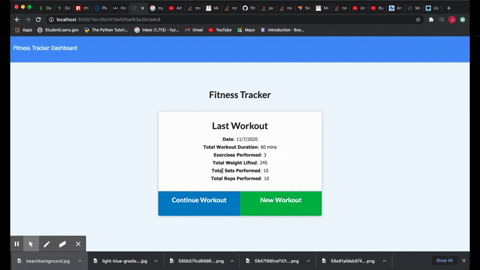
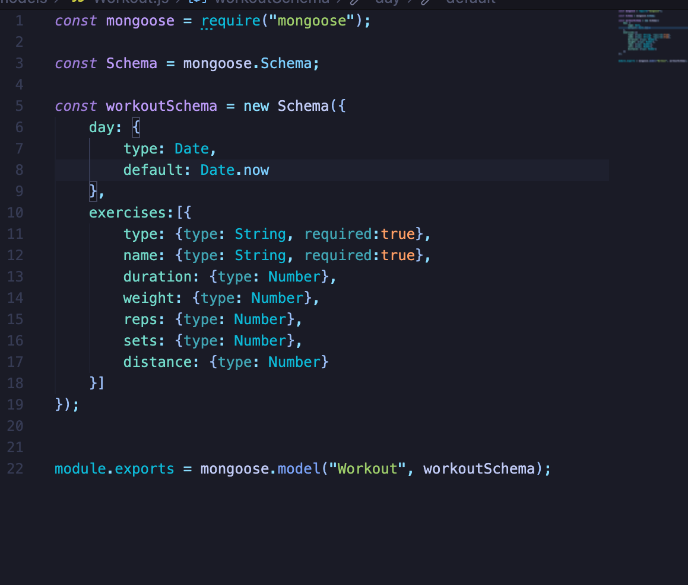
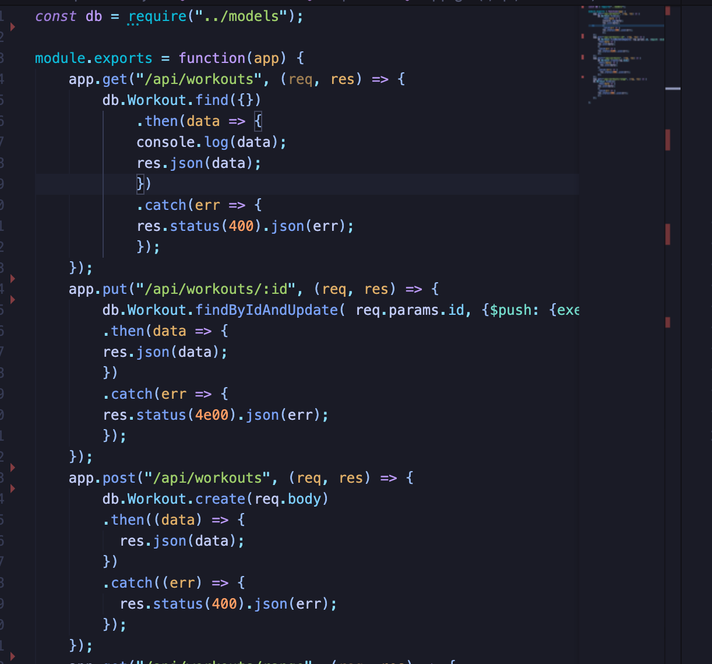

# workout-tracker

## Description 

## Table of Contents
* [Installation](#installation)
* [Usage](#usage)
* [Credits](#credits)
* [License](#license)
   
## Installation

The installation of this project is to click on the green code button in the top right corner. Then you can copy and paste the code via ssh or by downloading a zip file. Once you have downloaded the file there are a couple of things that must be downloaded in order for this application to run properly. The first is node.js once this is downloaded open up the terminal and navigate to the file that this project is saved in. Then run the code:
npm i 
This should download express, morgan and mongoose. Then all that is left to do is run the command:
node server.js 
in the termnal and then go to the browser and type in http://localhost:3000. or see the deployed heroku link [heroku link]()

## Usage 

[heroku link]()

                            Demo

                            Model

                            Routes

   
## Credits

Third party applications and instruction was provided by the University of California Berkeley' full stack Coding Bootcamp program as well as the utilization of node.js, express, mongoose, morgan and heroku.  

[UCB Coding Bootcamp](https://bootcamp.berkeley.edu/coding/)   

[Node.js](https://https://nodejs.org/en/)   

[Express](https://expressjs.com/) 

[Morgan](https://handlebarsjs.com/)

[Mongoose](https://www.mysql.com/)  

[heroku](https://www.heroku.com/free)   

## License

 MIT

## Badges

## Contact

[My Github](https://github.com/hondahelix) 

[My portfolio](https://nameless-castle-45341.herokuapp.com)